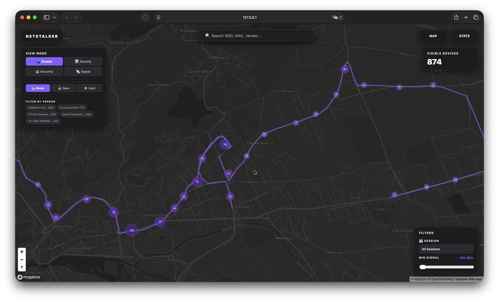
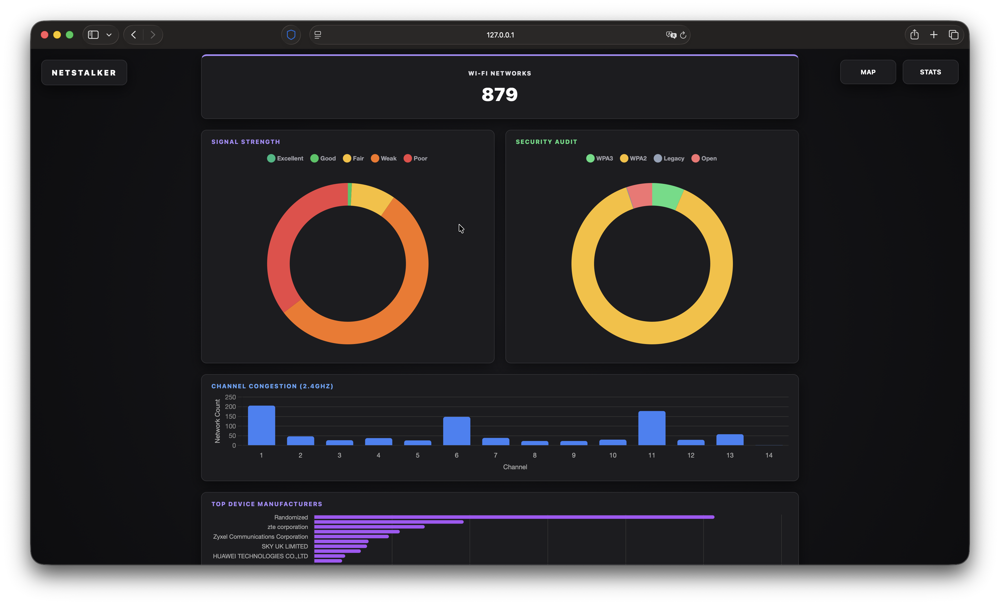
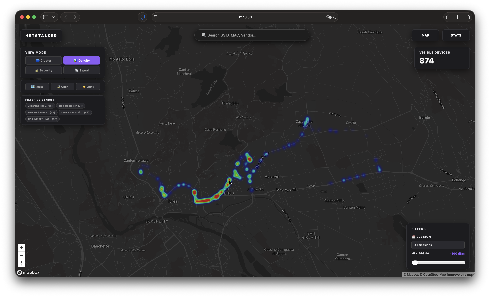
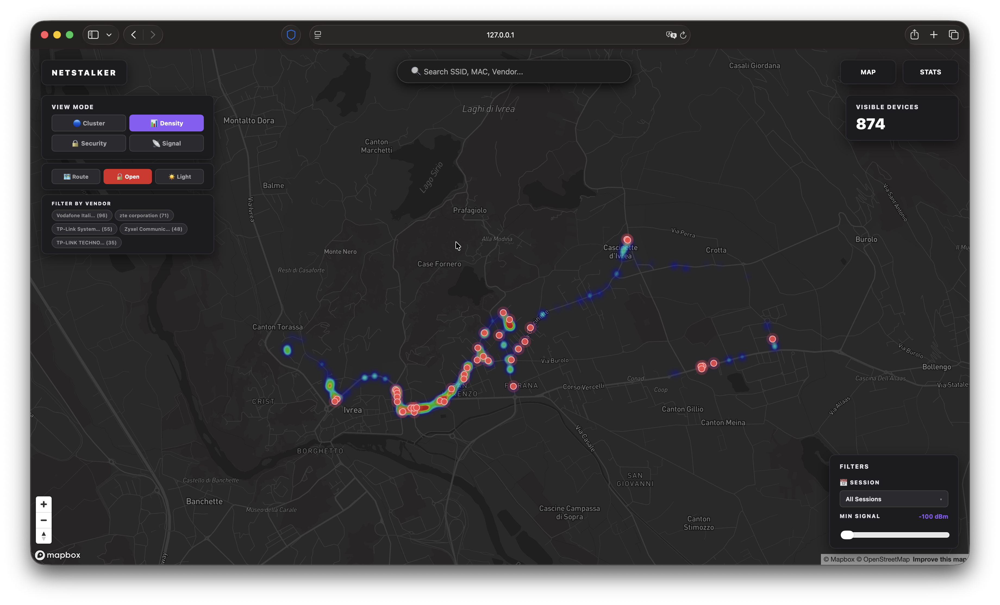
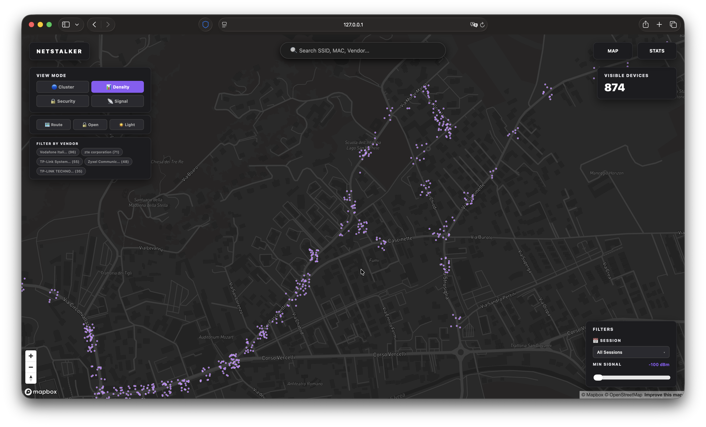

# NetStalker — Wardriving Visualization

Interactive map and stats dashboard for Wi-Fi wardriving data captured with ESP32/M5Stack hardware.

## Features

**Map Page**
- Density heatmap, security-colored points, signal-strength points
- Open networks highlight with red glow
- Vendor filter chips (top 5 manufacturers)
- Route visualization (driving path)
- Session filtering dropdown
- RSSI slider, SSID/MAC/vendor search
- Light/dark theme switcher
- All toggle states persist across refresh

**Stats Page**
- Signal strength distribution (doughnut)
- Security audit (doughnut)
- Channel congestion (bar chart)
- Top device manufacturers (horizontal bar)
- Most common SSIDs table

**Data Pipeline**
- Parses WigleWifi CSV files from wardriving sessions
- IEEE OUI database for MAC vendor resolution
- Deduplication, jitter, session tracking
- Outputs GeoJSON with AP points + route LineStrings

## Setup

### 1. Clone and configure

```bash
git clone https://github.com/filippocappa/netstalker.git
cd netstalker
cp config.example.js config.js
```

Edit `config.js` and add your Mapbox token:
```js
const CONFIG = {
    MAPBOX_TOKEN: "your_mapbox_token_here"
};
```

### 2. Add wardriving data

Place your WigleWifi CSV files in the `data/` folder.

### 3. Build GeoJSON

```bash
python build_data.py
```

This downloads the IEEE OUI database (first run), resolves vendors, and generates `data/wardrive.geojson`.

### 4. Open

```bash
python -m http.server 8000
```

Visit `http://localhost:8000`

## View Modes

| Mode | Description |
|------|-------------|
| Density | Heatmap showing AP concentration |
| Security | Green (WPA3) / Yellow (WPA2) / Red (Open) colored points |
| Signal | Purple (weak) to cyan/white (strong) colored points |
| None | Simple purple dots |


## Example Pictures

<p align="center">
  
</p>

<p align="center">
  
</p>

<p align="center">
  
</p>

<p align="center">
  
</p>

<p align="center">
  
</p>

## License
MIT
